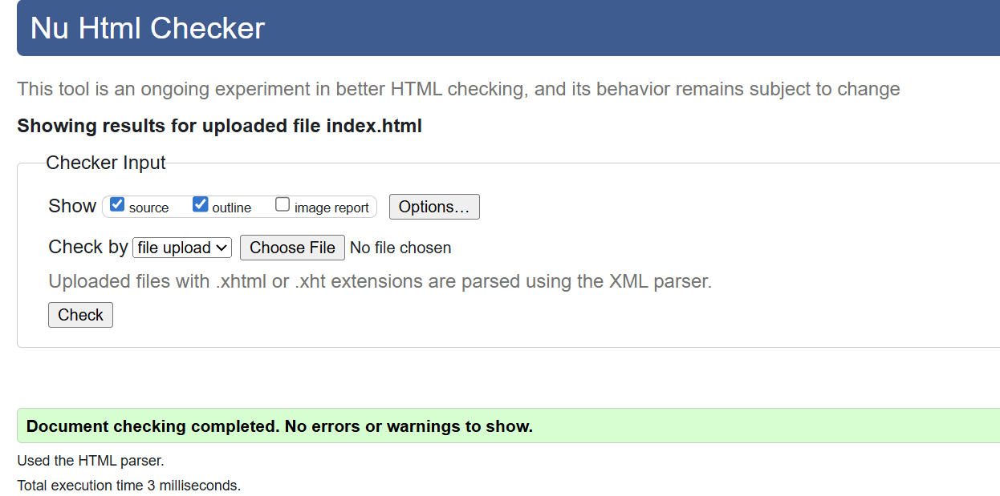
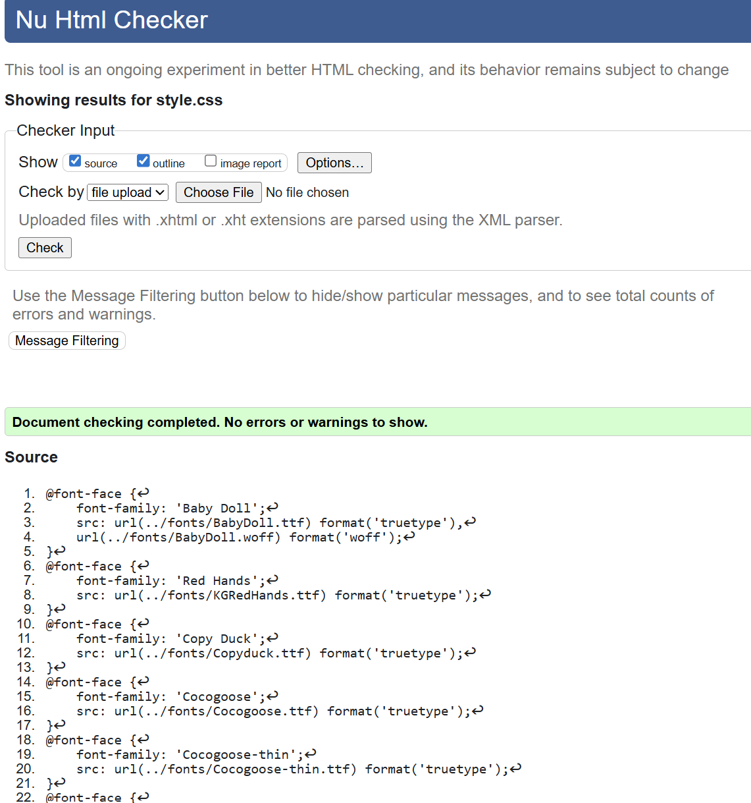
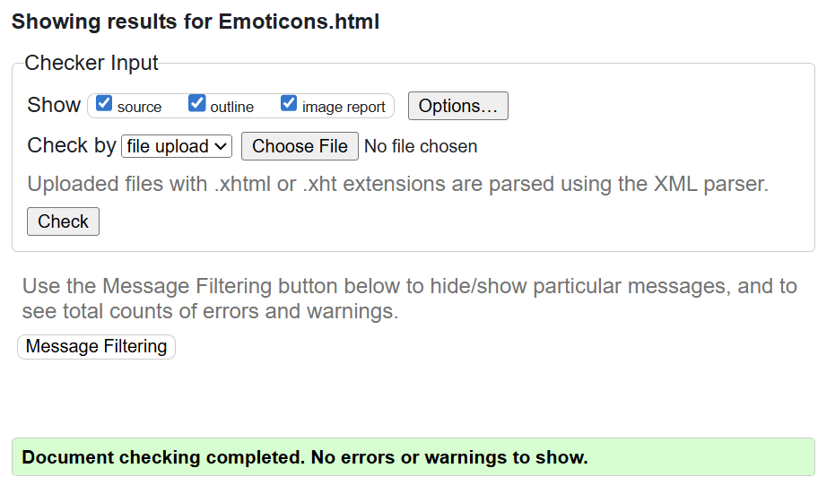
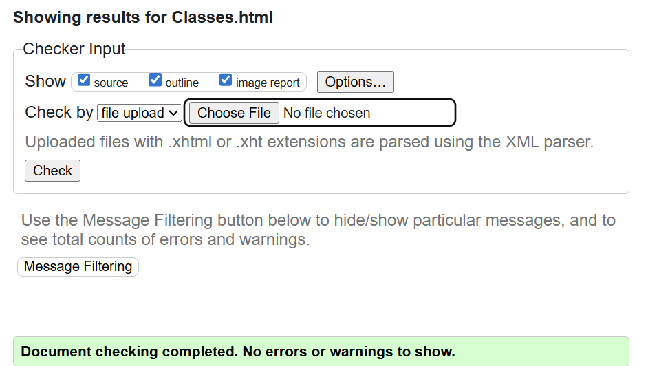
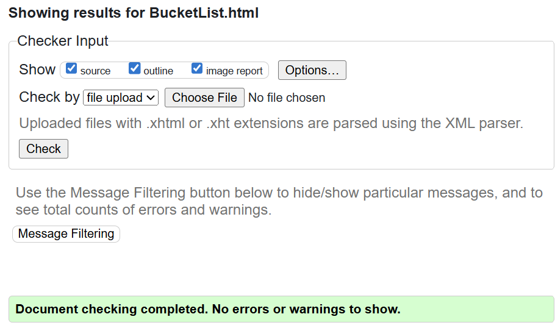
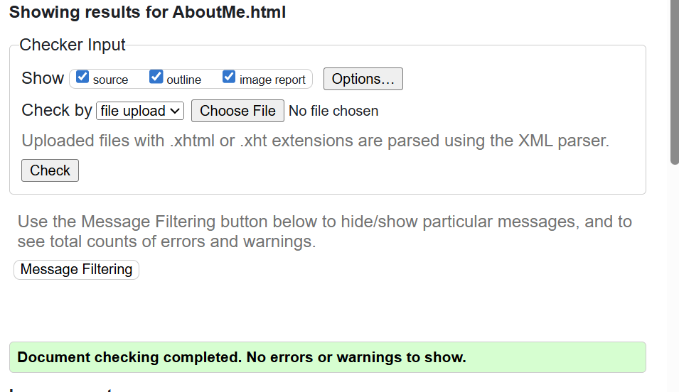

## Overview
I made a personal website sharing basic information about me. It includes 5 pages:

- **Home** – Introductory page that welcomes visitors.  
- **About Me** – Highlights my hobbies and interests.  
- **Classes** – Lists my current courses with short descriptions.  
- **Bucket List** – Outlines goals and experiences I’d like to achieve.  
- **Emoticons** – Displays fun and creative emoticons.  

---

## HTML Elements Used
- `<!DOCTYPE html>` – Defines the document type and ensures browsers render in standards mode.  
- `<html lang="en-US">` – Sets the root of the document and specifies language, viewport, title, and stylesheets.  
- `<body>` – Holds all the visible content of the page.  
- `<nav>` – Provides navigation bar for all pages.  
- `<section>` – Groups related content.  
- `<article>` – Used for individual class descriptions.  
- `<header>` / `<footer>` – Add structure for headings and end notes/links.  
- `
` – Containers for styling and layout.  
- Headings (`<h1>`, `<h2>`) – Organize content and improve readability.  
- Paragraphs (`
`) – Present descriptive text.  
- Lists (`<ul>`, `<li>`) – Display items in bullets.  
- Tables (`<table>`, `<tr>`, `<th>`, `<td>`) – Organize bucket list items.  
- Images (``) – Add visuals.  
- Links (`<a>`) – Navigation between pages and external sites.  
- Buttons (`<button>`) – Add interactive features.  
- `<link>` – Connects external CSS stylesheet.  
- `<script>` – Links JavaScript for interactivity.  

---

## CSS Styles Applied
I used CSS to style and customize the website by adding custom fonts, background colors, and gradients. Flexbox and scroll snapping were used for layout. The navigation bar includes spacing and hover effects, while text sizes, colors, and animations improve readability. Buttons were styled with rounded corners and hover states. Tables and lists include alternating row colors and centered formatting, and images were consistently sized and centered.  

---

## JavaScript Interactivity
I used JavaScript to add event listeners to buttons. The functions allow users to:  
1. Change the background color.  
2. Toggle the display of a table on and off.  

I'm not sure how to link to the checker sites with the results so I have screenshots:

(home page - index.html)

(css)

(Emoticons.html page)

(Classes.html)

(BucketList.html)

(AboutMe.html)
